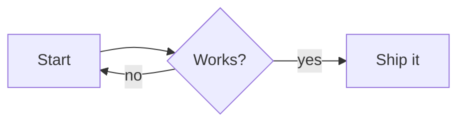
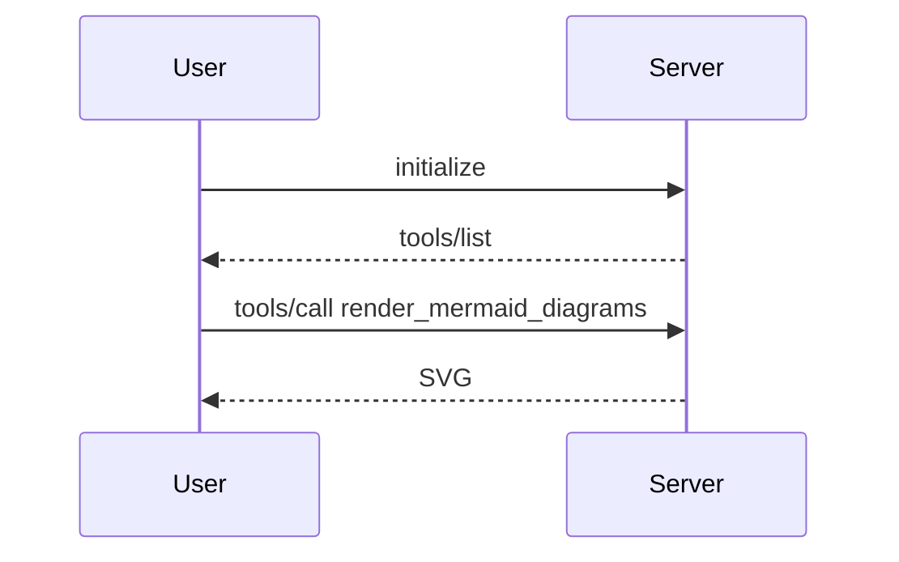

# Test 1

This note exercises every tool in the markdown-lint MCP server.

## A flowchart

## A sequence diagram

#### Notes

Heading jumped from level 2 to level 4 on purpose, to give lint_markdown a finding.
