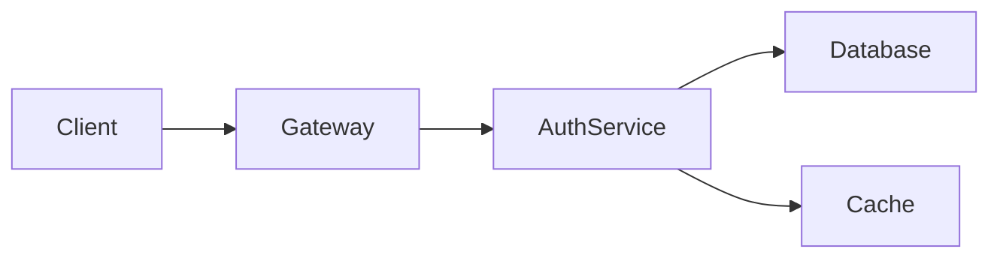
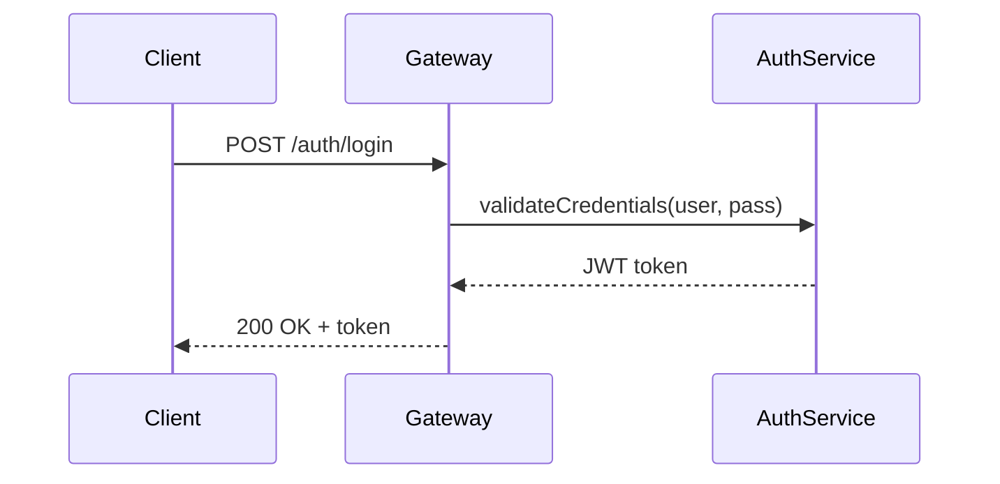

# System Architecture Overview

## Request Flow

```mermaid
flowchart LR
  Client --> Gateway
  Gateway --> AuthService
  AuthService --> Database
  AuthService --> Cache
```

## Component Relationships

```mermaid
sequenceDiagram
  participant C as Client
  participant G as Gateway
  participant A as AuthService
  C->>G: POST /auth/login
  G->>A: validateCredentials(user, pass)
  A-->>G: JWT token
  G-->>C: 200 OK + token
```
